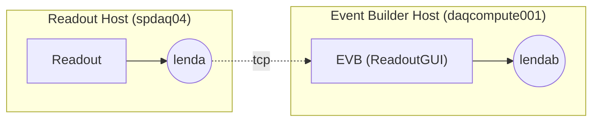
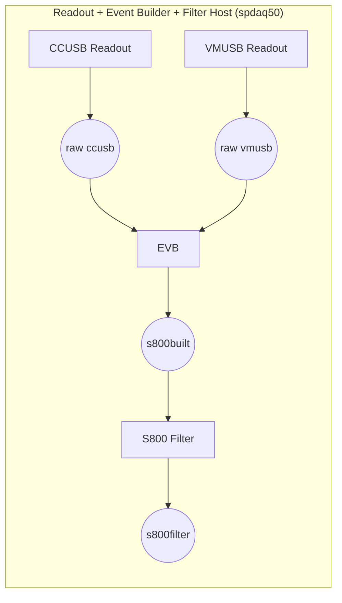
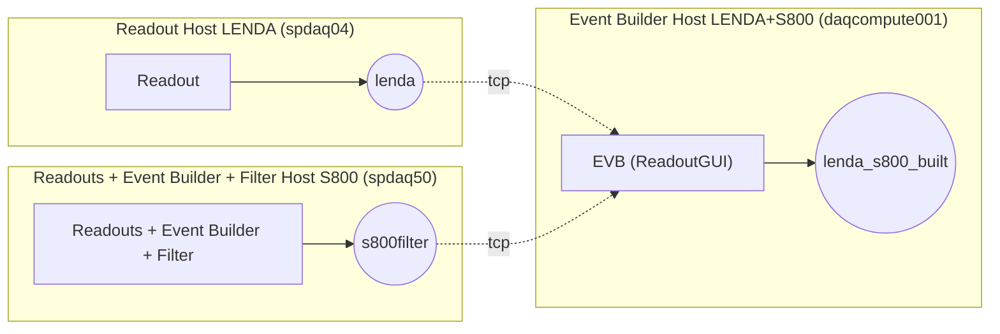
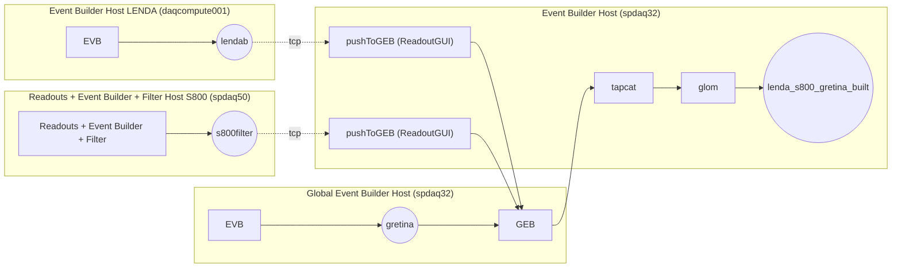
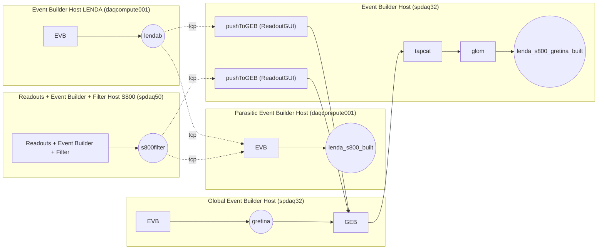

<a id="toTop"></a> 
Intended to complete the documentation written by Jeromy Tompkins and Jorge Pereira about merging the LENDA, S800, and GRETINA data acquisition systems.

<!-- tips:

<br> can be replaced by two spaces to return to a new line

-->

Previous documents:  
[DAQ overview]()  
[Electronics schematics]()  
[Adjusting LENDA DDAS timing]()  
[Report external clock]()  
[DAQ test]()  
[LENDA offset callibration]()  
[Instruction run 60Co]()  


DAQ configurations:
- [LENDA standalone](#lenda-standalone)
- [S800 standalone](#s800-standalone)
- [LENDA S800](#lenda-s800)
- [LENDA S800 Gretina](#lenda-s800-gretina)
- [LENDA S800 Gretina Parasitic event builder](#lenda-s800-gretina-parasitic-event-builder)


<!----------------------------------------------------------------------->
# LENDA standalone


The DDAS system, which is being used to read out LENDA, consists of the standard DDAS Readout_extcl program and an event builder. The Readout_extcl program runs on a Readout Host machine and outputs its data to the ring buffer named “lenda”. An event builder runs on an Event Builder Host machine to correlate event data from that readout program. The event builder will output data into a ring buffer named “lendab” on the Event Builder Host machine.

## Steps to setup LENDA
1. Define the source for the ReadoutGUI (.settings.tcl file)  

The source is defined with "set dataSources". In the following example, the parameters "--ring=lenda" and "--sourceid=3" set the ring buffer name and the source id, these are provided to the event builder (ReadoutCallouts file).

```tcl
​​​​​​​​​​​​​​​​​​set EventLogger /usr/opt/nscldaq/11.3-031/bin/eventlog
set EventLoggerRing tcp://localhost/lendab
set EventLogUseNsrcsFlag 1
set EventLogAdditionalSources 0
set EventLogUseGUIRunNumber 0
set EventLogUseChecksumFlag 1
set EventLogRunFilePrefix run
set StageArea /user/e21014/stagearea/lenda
set run 53
set title {LaBr3 coincidence test S800+LENDA+GRETINA}
set recording 0
set timedRun 0
set duration 3600
set dataSources {{host spdaq04.nscl.msu.edu parameters {--ring=lenda --sourceid=3} path /usr/opt/daq/11.3-031/bin/DDASReadout_extcl provider SSHPipe sourceid 0 wdir /user/e21014/LENDA/crate_1}}
```
2. Create a ReadoutCallouts.tcl file  

This file configures the lenda event builder that will return a local (where the readout is started) built event, named "lendab" in this example.
It includes the package ReadoutGuiRemoteControl, necessary to be able to enslave the ReadoutGUI when using a master GUI, the line RemoteControlClient::initialize is also necessary.

```tcl
package require evbcallouts
package require ReadoutGuiRemoteControl
RemoteControlClient::initialize

EVBC::useEventBuilder

proc OnStart {} {

    EVBC::initialize -gui true -restart true -glomdt 100 -glomid 1 -glombuild true -destring lendab

}

# last three args mean: do not expect body headers in data, oneshot mode enabled, timeout after 20 seconds
EVBC::registerRingSource tcp://spdaq04.nscl.msu.edu/lenda {} 3 "lenda data source 3" 1 1 20 ;
```

3. Create bash scripts to setup the environement and start the Readout

For this example there are two bash scripts "godaqLENDA" and "startrdo_lenda", this firt one just ssh to the Event Builder machine and apply the buster command to the second bash script, which sets the DAQ environement and starts the ReadoutShell command.


```bash
#!/bin/bash
ssh -Y daqcompute001.frib.msu.edu $HOME/bin/bustercmd $HOME/bin/startrdo_lenda
```

```bash
#!/bin/bash
. ~/.bashrc
VERSION=11.3-031

echo The timezone is $TZ
echo Using NSCLDAQ $VERSION

source /usr/opt/nscldaq/$VERSION/daqsetup.bash -f
echo DAQBIN is $DAQBIN

export INFINITY_CLOCK=YES
echo Using infinity clock: $INFINITY_CLOCK

#export FIFO_THRESHOLD=1
#echo Using FIFO threshold: $FIFO_THRESHOLD

cd ~/LENDA
export EVENTS=/user/e21014/stagearea/lenda
echo Event space is $EVENTS

$DAQBIN/ReadoutShell
```
4. Make sure to have a good .set file for DDAS (not corrupted)  
(?)


[Go to top](#toTop)
<!----------------------------------------------------------------------->
# S800 standalone

<!--
Text
-->
[Go to top](#toTop)


<!----------------------------------------------------------------------->

# LENDA S800

The S800 and LENDA DAQs can be run together separate from GRETINA. To accomplish this, a master ReadoutGUI is used to enslave the standalone versions of the LENDA and S800 DAQs. Data is pulled from the lenda and s800filter ring buffers and sent to an event builder. Note that usually the data is picked up from LENDA to be sent to GRETINA after it passes through the LENDA event builder. In this scenario, the data is picked up before the LENDA event builder to make the output of the event builder on the Event Builder Host compatible with existing versions of SpecTcl that analyze merged LENDA and S800 data. In the end, the data is all the same, it is built one fewer time.


## Steps to setup LENDA + S800
1. Define the source for the ReadoutGUI (.settings.tcl file)  

In stagearea (/mnt/events/e21014) a directory called s800lenda contains the .settings.tcl file. The lenda and s800 Readouts have to be started on their respective Readout Host machine (spdaq04 and spdaq50).
In `set dataSources` one tells to get the local ring buffers on the Readout Hosts where are started the ReadoutGUIs for lenda and s800.

```tcl
set EventLogger /usr/opt/nscldaq/11.3-031/bin/eventlog
set EventLoggerRing tcp://localhost/lenda_s800_built
set EventLogUseNsrcsFlag 1
set EventLogAdditionalSources 0
set EventLogUseGUIRunNumber 0
set EventLogUseChecksumFlag 1
set EventLogRunFilePrefix run
set StageArea /user/e21014/stagearea/s800lenda
set run 7
set title {S800 LENDA longevity run}
set recording 0
set timedRun 0
set duration 18000
set dataSources {{host spdaq04.nscl.msu.edu provider RemoteGUI sourceid 0 user e21014} {host spdaq50.nscl.msu.edu provider RemoteGUI sourceid 1 user s800}}
```
​​​​​​​​​​​​​​​​​​​​​​​​​​​​​​​​​​​​​​​​​​​​​​​​​​​​​​​​​​​​​​​​​​​​​​​​​​​​​​​​​​​​​​​​​​​​

2. Create a ReadoutCallouts.tcl file  

The ReadoutCallouts.tcl file is placed in a directfory called S800LENDA in the experiment account home (/user/e21014). It sets up the merged s800+lenda event builder that will return a local (daqcompute001.frib.msu.edu) built event named in this example lenda_s800_built.

```tcl
package require evbcallouts

wm title . "S800 & LENDA ONLY"

EVBC::useEventBuilder
#EVBC::configParams window 100

set ddasconfigpath [file join /user e21014 LENDA crate_1 cfgPixie16.txt]

proc OnStart {} {

    EVBC::initialize -gui true -restart true -glomdt 100 -glombuild true -destring lenda_s800_built

}

proc OnBegin run {
}

proc OnEnd run {
}

EVBC::registerRingSource tcp://spdaq04.nscl.msu.edu/lenda {} {3} "lenda" 1 1 20 ; 
EVBC::registerRingSource tcp://spdaq50.nscl.msu.edu/s800filter {} {2} "s800" 1 1 20 ; 
# last three args mean: do not expect body headers in data, oneshot mode enabled, timeout after 20 seconds
```

3. Create bash scripts to setup the environement and start the Readout

See LENDA standalone.


```bash
#!/bin/bash
ssh -Y daqcompute001.frib.msu.edu $HOME/bin/bustercmd $HOME/bin/startrdo_s800lenda
```

```bash
#!/bin/bash
. ~/.bashrc
VERSION=11.3-031

echo The timezone is $TZ
echo Using NSCLDAQ $VERSION

source /usr/opt/nscldaq/$VERSION/daqsetup.bash -f
echo DAQBIN is $DAQBIN

cd ~/S800LENDA
export EVENTS=/user/e21014/stagearea/s800lenda
$DAQBIN/ReadoutShell
```

## Tests 

(similar to what is described in DAQtest_e16019+e15222-Sep2016.pdf) 
 
The setup used in these tests was installed in the S3 basement level and included a LENDA bar (LB) and a reference detector (LSci, Liquid scintillator) placed at about 50 cm from each other facing a 22Na source located approximately in the middle point. Both, LSci and LB PMTs were biased with two Canberra 300 2D dual-channel HV modules. Signal cables from the top and bottom PMTs of the LB were connected to channels 0 and 1 of a 250-MHz pixie-16 module installed in slot 0 of the LENDA DDAS rack (in S3 basement level). Signals from LSci were split and sent to LENDA and S800 electronics. The “LENDA” branch connected LSci to channel 15 of the DDAS pixie-16 module to provide the reference time signal for LENDA DDAS. The “S800 branch” connected LSci (in the S3 base level) to channel 0 of a LeCroy variable amplifier (typically used to process signals from the E1_top FP scintillator in S800 experiments) in the S800 rack on the top level of S3. Thus, LSci mimics the time-reference detectors (either E1 SCI or OBJ SCI) that we are planning to use in the experiments.
 
For most of the measurements done in the tests, the S800 ULM was run in “coincidence” or “singles and coincidence” modes. As mentioned above, the S800 trigger was provided by the LSci detector. The ULM coincidence was done between the S800 trigger and the “secondary” input of the ULM. This “secondary” input was an OR between GRETINA triggers and LENDA triggers. The later was taken from channel o7 of the DDAS breakout module, which outputs signals whenever there is a coincidence between signals from the top and bottom PMTs of the LENDA bar [i.e. whenever the delayed logic fast-trigger signals from pixie-16 channel 0 and channel 1 overlap]. Note that although GRETINA was “0R-ed” with LENDA, we didn’t use it in our tests.
 
The 100-MHz clock from GRETINA, downscaled to 12.5-MHz, was sent to the S800 (via ULM) and LENDA DDAS (via input i3 of breakout module). Both S800 and LENDA reset their external clocks whenever IMP_SYNCH and go bit signals from S800 to LENDA DDAS and are send to LENDA DDAS. This guarantees synchronization between the two DAQs.
 
Summary of the signals communicated via patch panels between downstairs and the S800 electronics,

to S800 electronics :
- LSci (to mimic E1_up trigger signal)
 -LENDA trigger (secondary trigger)

to DDAS :
- Clock (external clock from gretina downscaled to 12.5MHz)
- IMP. Sync. (reset clock)
- Go bit (issued when s800 is initialized and ready to receive trigger)
- Live trigger (external trigger)
Note: the LSci signal is also send to ch15 of DDAS module to provide the reference time signal.

[Go to top](#toTop)
<!----------------------------------------------------------------------->

# LENDA S800 Gretina

<!--
Text
-->
[Go to top](#toTop)
<!----------------------------------------------------------------------->

# LENDA S800 Gretina Parasitic event builder

<!--
Text
-->
[Go to top](#toTop)
