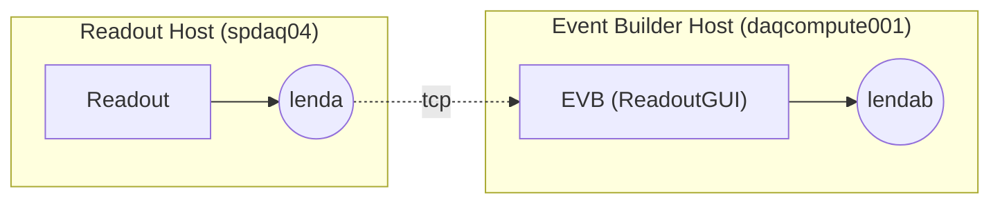
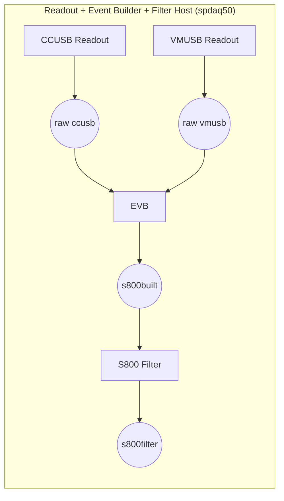
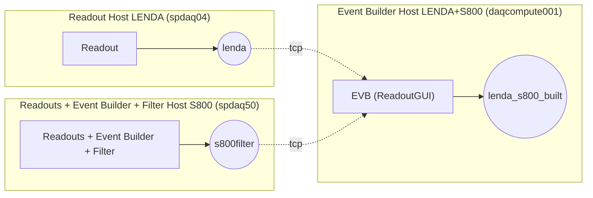
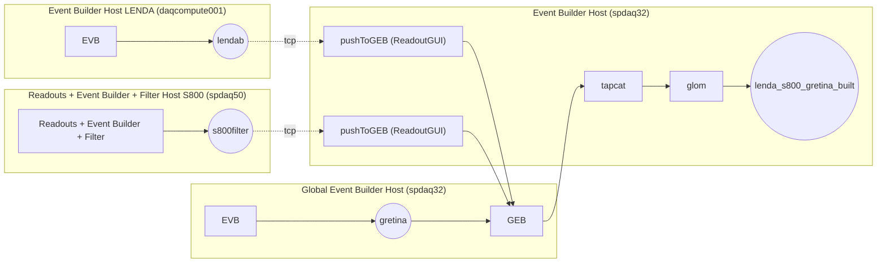
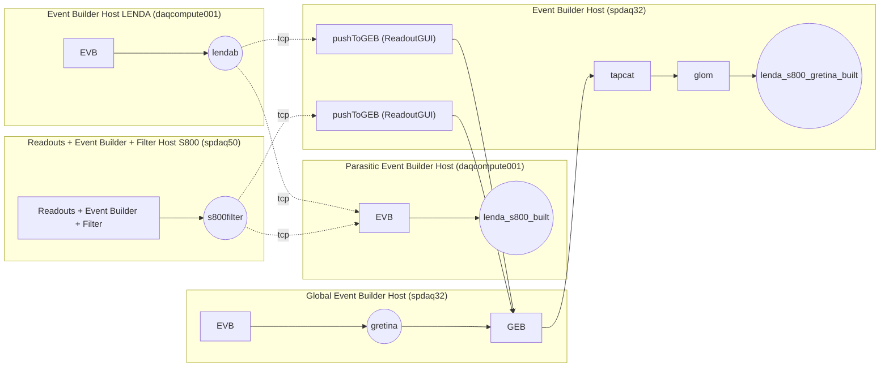

<a id="toTop"></a> 
Intended to complete the documentation written by Jeromy Tompkins and Jorge Pereira about merging the LENDA, S800, and GRETINA data acquisition systems.

<!-- tips:

<br> can be replaced by two spaces to return to a new line

-->

Previous documents:  
[DAQ overview]()  
[Electronics schematics]()  
[Adjusting LENDA DDAS timing]()  
[Report external clock]()  
[DAQ test]()  
[LENDA offset callibration]()  
[Instruction run 60Co]()  


DAQ configurations:
- [LENDA standalone](#lenda-standalone)
- [S800 standalone](#s800-standalone)
- [LENDA S800](#lenda-s800)
- [LENDA S800 Gretina](#lenda-s800-gretina)
- [LENDA S800 Gretina Parasitic event builder](#lenda-s800-gretina-parasitic-event-builder)


<!----------------------------------------------------------------------->
# LENDA standalone


The DDAS system, which is being used to read out LENDA, consists of the standard DDAS Readout_extcl program and an event builder. The Readout_extcl program runs on a Readout Host machine and outputs its data to the ring buffer named “lenda”. An event builder runs on an Event Builder Host machine to correlate event data from that readout program. The event builder will output data into a ring buffer named “lendab” on the Event Builder Host machine.

## Steps to setup LENDA
1. Define the source for the ReadoutGUI (.settings.tcl file)  

The source is defined with "set dataSources". In the following example, the parameters "--ring=lenda" and "--sourceid=3" set the ring buffer name and the source id, these are provided to the event builder (ReadoutCallouts file).

```tcl
​​​​​​​​​​​​​​​​​​set EventLogger /usr/opt/nscldaq/11.3-031/bin/eventlog
set EventLoggerRing tcp://localhost/lendab
set EventLogUseNsrcsFlag 1
set EventLogAdditionalSources 0
set EventLogUseGUIRunNumber 0
set EventLogUseChecksumFlag 1
set EventLogRunFilePrefix run
set StageArea /user/e21014/stagearea/lenda
set run 53
set title {LaBr3 coincidence test S800+LENDA+GRETINA}
set recording 0
set timedRun 0
set duration 3600
set dataSources {{host spdaq04.nscl.msu.edu parameters {--ring=lenda --sourceid=3} path /usr/opt/daq/11.3-031/bin/DDASReadout_extcl provider SSHPipe sourceid 0 wdir /user/e21014/LENDA/crate_1}}
```
2. Create a ReadoutCallouts.tcl file  

This file configures the lenda event builder that will return a local (where the readout is started) built event, named "lendab" in this example.
It includes the package ReadoutGuiRemoteControl, necessary to be able to enslave the ReadoutGUI when using a master GUI, the line RemoteControlClient::initialize is also necessary.

```tcl
package require evbcallouts
package require ReadoutGuiRemoteControl
RemoteControlClient::initialize

EVBC::useEventBuilder

proc OnStart {} {

    EVBC::initialize -gui true -restart true -glomdt 100 -glomid 1 -glombuild true -destring lendab

}

# last three args mean: do not expect body headers in data, oneshot mode enabled, timeout after 20 seconds
EVBC::registerRingSource tcp://spdaq04.nscl.msu.edu/lenda {} 3 "lenda data source 3" 1 1 20 ;
```

3. Create bash scripts to setup the environement and start the Readout

For this example there are two bash scripts "godaqLENDA" and "startrdo_lenda", this firt one just ssh to the Event Builder machine and apply the buster command to the second bash script, which sets the DAQ environement and starts the ReadoutShell command.


```bash
#!/bin/bash
ssh -Y daqcompute001.frib.msu.edu $HOME/bin/bustercmd $HOME/bin/startrdo_lenda
```

```bash
#!/bin/bash
. ~/.bashrc
VERSION=11.3-031

echo The timezone is $TZ
echo Using NSCLDAQ $VERSION

source /usr/opt/nscldaq/$VERSION/daqsetup.bash -f
echo DAQBIN is $DAQBIN

export INFINITY_CLOCK=YES
echo Using infinity clock: $INFINITY_CLOCK

#export FIFO_THRESHOLD=1
#echo Using FIFO threshold: $FIFO_THRESHOLD

cd ~/LENDA
export EVENTS=/user/e21014/stagearea/lenda
echo Event space is $EVENTS

$DAQBIN/ReadoutShell
```
4. Make sure to have a good .set file for DDAS (not corrupted)  
(?)


[Go to top](#toTop)
<!----------------------------------------------------------------------->
# S800 standalone

<!--
Text
-->
[Go to top](#toTop)
<!----------------------------------------------------------------------->

# LENDA S800


<!--
Text
-->
[Go to top](#toTop)
<!----------------------------------------------------------------------->

# LENDA S800 Gretina

<!--
Text
-->
[Go to top](#toTop)
<!----------------------------------------------------------------------->

# LENDA S800 Gretina Parasitic event builder

<!--
Text
-->
[Go to top](#toTop)
